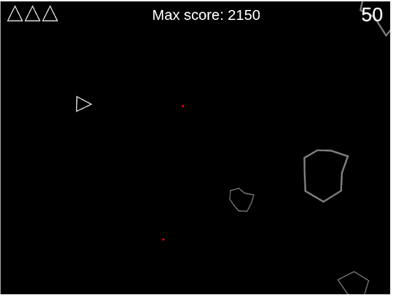

# **Asteroids** (Manual de Usuario)

## Índice

1. [Descripción](#Descripción)
2. [Inicio y ejecución](#Inicio-y-ejecución)
3. [Controles básicos](#Controles-básicos)
4. [Objetivo de Asteroids](#Objetivo-de-Asteroids)
5. [Pantallas del juego](#Pantallas-del-juego)
   1. [Objetos del juego](#Objetos-del-juego)
   2. [Pantalla inicial](#Pantalla-inicial)
   3. [Fin de la partida](#Fin-de-la-partida)
6. [Cómo jugar](#Cómo-jugar)
7. [Diviértete](#Diviértete)

## Descripción	
**Asteroids,** es un juego arcade donde el principal objetivo del juego es disparar con el láser a los asteroides evitando colisionar con ellos y sus fragmentos.

## Inicio y ejecución
Para ejecutar el juego descargar el archivo Asteroids.zip y descomprimirlo. Abrir el directorio Asteroids y hacer doble click sobre **Asteroids.html**. Se abrirá con el navegador que utilice por defecto. No es necesario instalar ningún programa complementario, solamente tener un navegador instalado. 

## Controles básicos
Para hacer un uso correcto y eficaz de los controles para evitar colisionar con los asteroides se muestran a continuación: 

* Flecha superior      ↑: acelerar
* Flecha izquierda ←: girar hacia la izquierda
* Flecha derecha   →: girar hacia la derecha
* Barra espaciadora  : disparar

	

## Objetivo de Asteroids
El objetivo es sobrevivir el máximo tiempo posible y obtener la máxima puntuación posible destruyendo todos los asteroides con el láser, sin que estos colisionan contra nuestra nave. 
Hay que tener en cuenta que un asteroide de mayor tamaño se fracciona en asteroides más pequeños al ser alcanzado por el láser.
Tendremos como máximo 3 intentos o vidas en cada partida.

	

## Pantallas del juego

### Objetos del juego
Se puede observar en la imagen todas las partes que forman nuestro juego.

	

### Pantalla inicial
Pantalla inicial al iniciar el juego, empezamos en el nivel 1, a medida que destruyamos los asteroides el nivel se va incrementando

	

### Fin de la partida
Una vez consumidas las 3 vidas terminará la partida lo que conlleva que se reinicialice a cero la puntuación actual.

	

## Cómo jugar
* Una vez iniciado el juego según lo descrito en el apartado 2. Podemos empezar a disfrutar de la experiencia del juego.
* Aparecerá la nave en el punto central del juego junto con los asteroides en movimiento.
* Tendremos 3 vidas en cada partida y comenzaremos en el nivel 1.
* Si se produce una colisión con vidas disponibles se restará una vida,  se reinicializa la nave en la posición inicial. Tendremos unos segundos en el cual la nave parpadeara y aunque nos posicionamos sobre algún asteroide no habrá colisión.
* A medida que vamos avanzando de nivel el  número de asteroides se va incrementando como la velocidad que se mueven por el espacio.

## Diviértete
Con todos los pasos solo nos queda disfrutar jugar a Asteroids. Intentad conseguir la máxima puntuación llegando al máximo nivel posible, siendo los reyes del Asteroids. 

